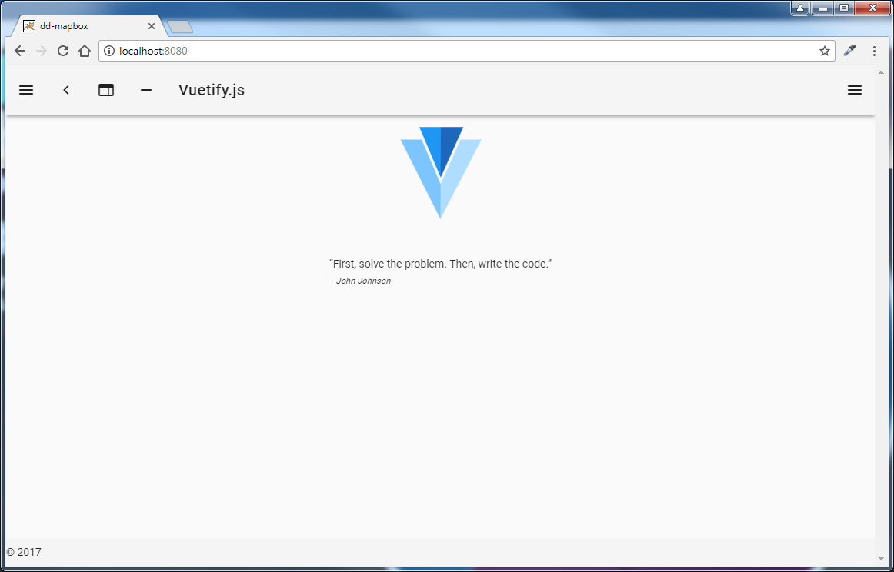
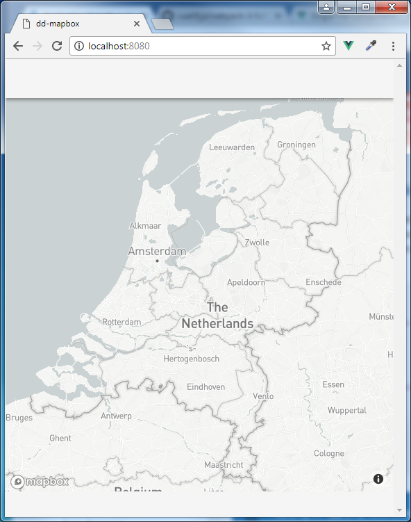

Creating a simple MapBox vieuwer using VueJS & Vuetify
------------------------------------------------------

1. Create a project folder, hosted in SVN or GIT

2. Install node.js and git, these are required to work with WebPack and the VuetifyJS component framework

3. Start with a WebPack template from the Vuetify.com website, select the WebPack template and follow the link to GitHub where you find some documentation and the following instructions at the bottom of the page:

4. Run a command prompt with the project folder as working directory and execute these commands to initialize Vue and the Vuetify WebPack template:
    
```
    > npm install -g vue-cli

    > vue init vuetifyjs/webpack dd-mapbox 
```     
 
You will be prompted to choose several options, just press enter except for "Install vue-router", "Set up unit tests", "Set up e2e tests with Nightwatch", "Use custom theme" enter No (N).

```
    > cd dd-mapbox

    > npm run dev
```

With the above steps you have used the vue-cli (VueJS command line interface) to scaffold a WebPack Project, which is a complete development environment using node.js based development tools, including ecmascript 2015 (ES6) support, a code-linter etc. 
The npm run dev command starts up node.js as a web server which hot-loads any changes you make to the source code so you keep this running while you are working on and debugging your code.

if you point your browser at http://localhost:8080 you will see the Vuetify template you have just installed.



You may want to read a little about VueJS, Vuetify and WebPack before you continue, also you need a code editor/ide to use as there is a large variety of editors that have plugins and or extensions to help you work with WebPack and VueJS:

 - Atom
 - Sublime text
 - Vim
 - WebStorm
 - Visual Studio Code (VS Code)
 - ?

Using Google Chrome as your web browser is strongly recommended as there are specific Vue extensions for the Chrome developer tools (you will be prompted to install them in chrome) and some code editors like VS Code can use the Chrome developers tools to further improve the debugging experience.

5. Now use your editor to open the file src/components/HelloWorld.vue then change the text on line 7 to 'Hello world" and if you still have your browser open you will see the text displayed in your browser displayed almost immediately after you save the file, this 'hot-loading' is a typical feature of WebPack.

6. Go back to the command prompt running in the dd-mapbox folder to install the vue2mapbox-gl Vue component that was published by Deltares:
    
```
    > npm install --save vue2mapbox-gl
```
    
    This should install vue2mapbox component and its dependencies (mapbox-gl, lodash) into the node_modules folder and will give a few warnings about fsvents optional dependency you should ignore.
    
    More information about the vue2mapbox-gl wrapper can be found on NPM (https://www.npmjs.com/package/vue2mapbox-gl) and the source code on Github (https://github.com/openearth/vue2mapbox-gl) 

7. Open the App.vue file that was part of the template, to begin with, simplify the markup inside the `<template>...</template>` tag by replacing it with the following:

```
    <v-app>
      <v-toolbar app></v-toolbar>
      <v-content>
        <HelloWorld/> 
      </v-content>
      <v-footer app></v-footer>
    </v-app>
```

If this is the first time you are using Vuetify, try looking up each of the Vuetify markup elements used here in the Vuetify documentation.

8. Open the main.js file and add the following statements to import the vue2mapbox-gl component:

```
    import Vue2MapboxGL from 'vue2mapbox-gl'

    Vue.use(Vue2MapboxGL)
```
    
Please note that simply copy-pasting the above is not enough, you need to have all the import statements in this file before the Vue.use statements. If you are using an editor with Vue extensions installed (ie. Atom, VS code) a linter will alert you and assist you with this, strongly recommended !

9. In the App.Vue file, replace the `<HelloWorld/>' element by the following:

```
    <v-mapbox 
      access-token="pk.-----------------"
      map-style="mapbox://styles/mapbox/light-v9"
      :center="[5.5, 52.078]"
      :zoom="6.5"
      :pitch="0"
      :bearing="0"
      id="map"
      ref="map">
    </v-mapbox>
```

Use your MapBox access token for the access-token property, your token is personal !

Then at the bottom of the App.Vue file add:

```
    <style >
      @import 'mapbox-gl/dist/mapbox-gl.css';
      #map {
      height: 100%;
      width: 100%;
      }
    </style>
```

10. Now that most of the default layout markup from the Vuetify template and the `HelloWorld` component are no longer used, cleanup the project a bit, in the App.Vuew file, clean up the `<script>` section, so that only this remains:

```
    <script>
    export default {
      data () {
        return {
      }
    },
    name: 'App',
    components: {
      }
    }
    </script>
```

Also you can delete src/components/HelloWorld.vue and src/assets/logo.png

Now run the project (you can just keep the 'npm run dev' development server running and see it hot-load your changes into chrome) and see if the Map of the Netherlands is displayed:


